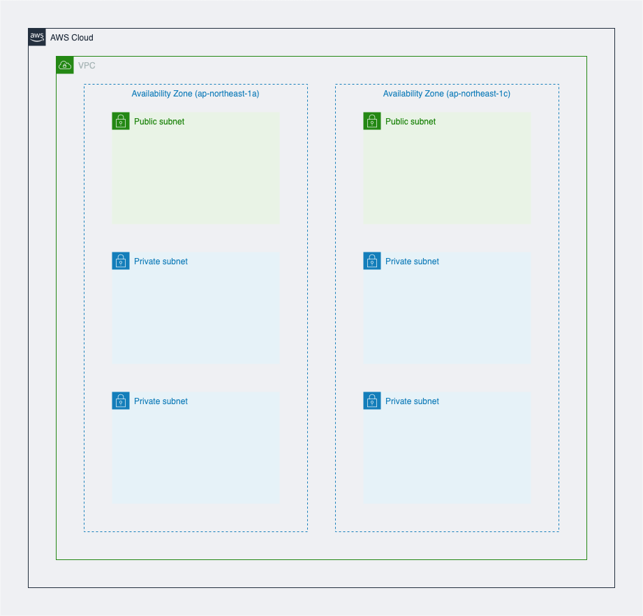

# Sample CDK TypeScript project

## OverView
This is a sample project for TypeScript development with CDK.

The `cdk.json` file tells the CDK Toolkit how to execute your app.

## Requirements

- node v14.x
- yarn v1.22.x
- cdk v2.x
- aws cli v2

```sh
# initialize
$ yarn
```

## Command Tips

```sh
# emits the synthesized CloudFormation template
$ yarn cdk synth

# compare deployed stack with current state
$ yarn cdk diff {stack name}
# all stacks
$ yarn cdk diff --all

# deploy this stack to your default AWS account/region
$ yarn cdk deploy --context stage={env} {stack name}
# default env=dev
$ yarn cdk deploy --all

# destroy stacks
$ yarn cdk destroy --context stage={env} {stack name}
$ yarn cdk destroy --all

# format
$ yarn run fmt

# test
$ yarn run build && yarn test
```

## Architecture(WIP)


